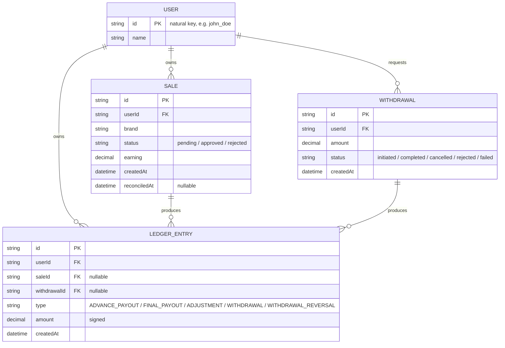
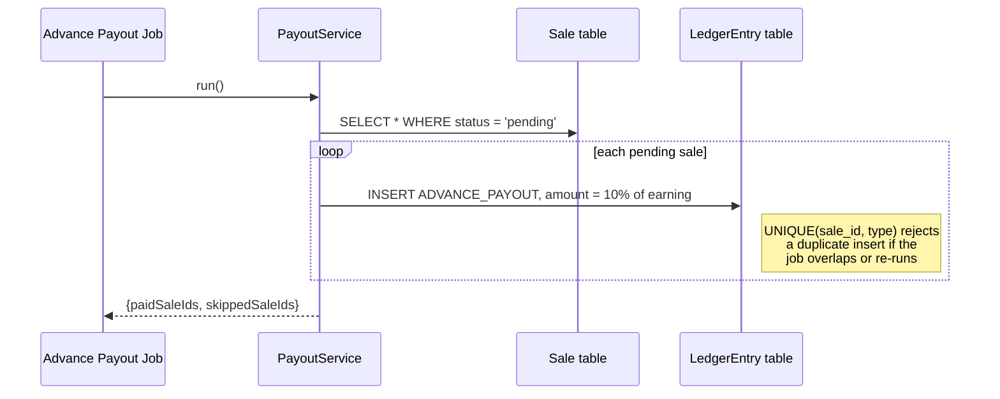
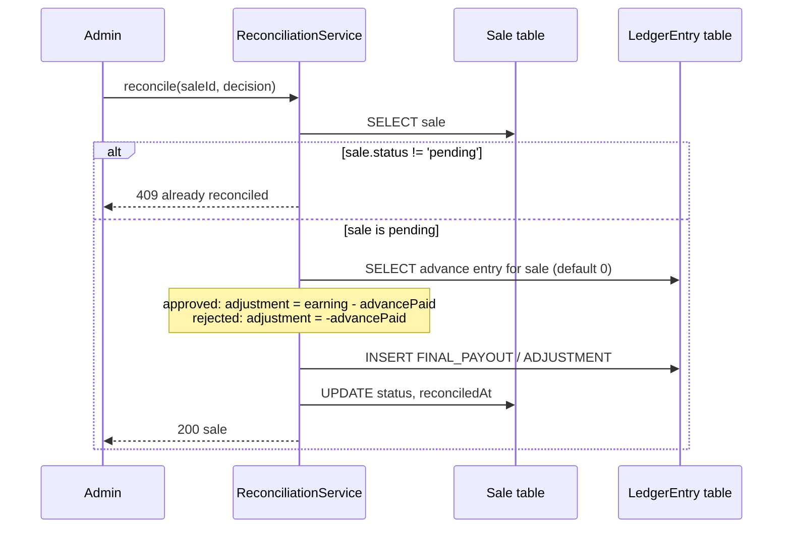
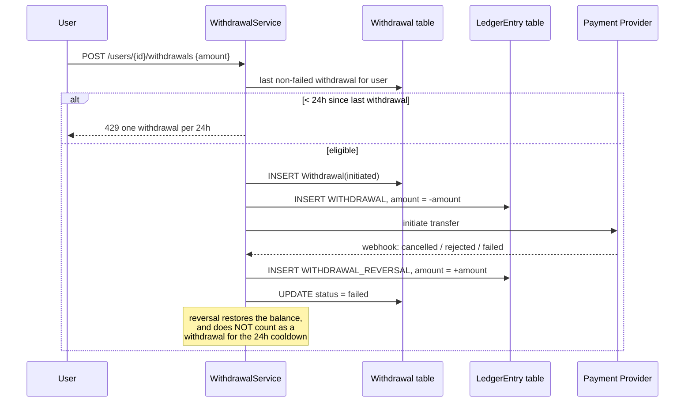

# User Payout Ledger

Low-level design and implementation of a payout management system for affiliate
sales: advance payouts on pending sales, reconciliation-driven final payouts,
withdrawal rate-limiting, and failed-payout recovery.

Built in Python with FastAPI + SQLAlchemy + SQLite.

## Core design decision: an append-only ledger, not a mutable balance

The obvious implementation keeps a `balance` field on `User` and increments/
decrements it as things happen. That version is easy to write and hard to
trust: nothing stops the advance-payout job from double-crediting on a retry,
there's no audit trail for *why* a balance is what it is, and "undo this
payout" means writing code to carefully reverse a mutation instead of just
recording what actually happened.

Instead, every money movement is a row in one **`LedgerEntry`** table, and a
user's balance is always `SUM(amount)` over their rows — derived, never
stored. This one modeling choice is what makes the trickier requirements in
the assignment straightforward instead of subtle:

| Requirement | How the ledger satisfies it |
|---|---|
| "must never receive another advance payout, even if the job runs multiple times" | A `UNIQUE(sale_id, type)` constraint on `LedgerEntry` — enforced by the database, not an `if` check that a race condition can slip past. |
| "adjusted against the user's final payout" | Reconciliation inserts one signed adjustment row; it never touches the original advance row. |
| "credit the failed payout amount back... allow another withdrawal" | A `WITHDRAWAL_REVERSAL` row is inserted; the original `WITHDRAWAL` debit is never edited or deleted. |
| Auditability | The full history of *why* a balance is what it is already exists — it's just the ledger. |

## Entity Relationship Diagram



`LEDGER_ENTRY` has two unique constraints: `(sale_id, type)` and
`(withdrawal_id, type)`. SQLite (like Postgres) treats `NULL` as distinct from
every other `NULL` in a unique index, so a `WITHDRAWAL` entry (`sale_id` is
`NULL`) never collides with an `ADVANCE_PAYOUT` entry for some sale, and vice
versa — each constraint only bites when it's actually relevant.

## Flows

### 1 — Advance payout job (`POST /jobs/advance-payout`)



### 2 — Reconciliation & final payout (`POST /admin/sales/{id}/reconcile`)



### 3 — Withdrawal & failed payout recovery



## API reference

| Method | Path | Purpose |
|---|---|---|
| `POST` | `/users` | Create a user (`{id, name}`) |
| `GET` | `/users/{id}/balance` | Current withdrawable balance |
| `GET` | `/users/{id}/ledger` | Full ledger history for a user |
| `POST` | `/sales` | Create a sale (`{userId, brand, earning}`), starts `pending` |
| `GET` | `/sales?userId=` | List sales, optionally filtered by user |
| `GET` | `/sales/{id}` | Get one sale |
| `POST` | `/jobs/advance-payout` | Run the advance-payout job over all pending sales (idempotent) |
| `POST` | `/admin/sales/{id}/reconcile` | `{decision: "approved" \| "rejected"}` — apply the final payout/adjustment |
| `POST` | `/users/{id}/withdrawals` | `{amount}` — request a withdrawal (24h rate limit + balance check) |
| `POST` | `/webhooks/payout-status` | `{withdrawalId, status}` — provider callback for `completed`/`cancelled`/`rejected`/`failed` |

## Edge cases & failure scenarios handled

- **Advance payout job re-run or overlapping runs** → second pass is a no-op per sale (DB unique constraint, not application logic).
- **Reconciling an already-reconciled sale** (retry, double-click, replayed request) → `409`, no double adjustment.
- **Sale rejected when its advance was never actually paid** (job hadn't run yet, or failed) → adjustment correctly computed against `0`, not a hardcoded advance amount.
- **Withdrawal requested for more than the current balance** → `400`.
- **Second withdrawal inside 24h** → `429` with a `Retry-After` header.
- **A failed/cancelled/rejected withdrawal** → balance is restored via a reversal entry, and — deliberately — does **not** consume the user's 24h withdrawal window, since the user never actually received anything.
- **Duplicate webhook delivery for the same failure** → the `(withdrawal_id, type)` unique constraint means the reversal is only ever applied once.

## Assumptions & trade-offs

- **Balance is computed, not cached.** Simpler and always correct; at scale you'd materialize a cached balance per user and reconcile it against the ledger periodically, trading a bit of read latency for write-side simplicity here.
- **Currency as `Decimal`/`NUMERIC(12,2)`, not integer minor units.** Matches the assignment's rupee examples directly; a production system handling many currencies would store integer paise/cents to fully sidestep floating-point/rounding ambiguity.
- **No migration tool wired up** (`Base.metadata.create_all` on startup) — appropriate for this from-scratch assignment; a real service would use Alembic.
- **SQLite for both app and tests** — zero setup for a reviewer to run this; the schema has no SQLite-specific features and would move to Postgres unchanged.
- **`GET /jobs/advance-payout` is exposed as an HTTP endpoint** rather than wired to an actual scheduler, so the idempotency behavior is trivial to demonstrate with two curl calls; in production this would be invoked by a cron/queue worker instead.
- **A failed withdrawal doesn't block the next one.** Not explicit in the assignment, but the alternative (penalizing the user with a 24h wait for a failure that wasn't their fault) seemed like the wrong default — called out here since it's a real design decision, not an oversight.

## Running it

```bash
python3 -m venv .venv
source .venv/bin/activate      # Windows: .venv\Scripts\activate
pip install -r requirements.txt

uvicorn app.main:app --reload  # http://127.0.0.1:8000/docs for interactive API docs
```

## Testing

```bash
source .venv/bin/activate
python -m pytest -v
```

13 tests cover: idempotent advance payouts, the assignment's exact worked
example (three ₹40 sales → one rejected, two approved → ₹68 in reconciliation
adjustments, ₹80 total lifetime payout), double-reconciliation rejection, the
24h withdrawal cooldown (including time-travel past it), insufficient-balance
rejection, and failed-withdrawal recovery (including duplicate-webhook
safety).

## Worked example, end to end

```bash
curl -X POST localhost:8000/users -d '{"id":"john_doe","name":"John Doe"}' -H 'Content-Type: application/json'

curl -X POST localhost:8000/sales -d '{"userId":"john_doe","brand":"brand_1","earning":40}' -H 'Content-Type: application/json'
curl -X POST localhost:8000/sales -d '{"userId":"john_doe","brand":"brand_1","earning":40}' -H 'Content-Type: application/json'
curl -X POST localhost:8000/sales -d '{"userId":"john_doe","brand":"brand_1","earning":40}' -H 'Content-Type: application/json'

curl -X POST localhost:8000/jobs/advance-payout          # pays ₹4 x 3 = ₹12
curl localhost:8000/users/john_doe/balance               # {"balance": "12.00"}

# reconcile: one rejected, two approved (use the sale ids returned above)
curl -X POST localhost:8000/admin/sales/{sale1}/reconcile -d '{"decision":"rejected"}'  -H 'Content-Type: application/json'
curl -X POST localhost:8000/admin/sales/{sale2}/reconcile -d '{"decision":"approved"}'  -H 'Content-Type: application/json'
curl -X POST localhost:8000/admin/sales/{sale3}/reconcile -d '{"decision":"approved"}'  -H 'Content-Type: application/json'

curl localhost:8000/users/john_doe/balance                # {"balance": "80.00"}
curl localhost:8000/users/john_doe/ledger                 # full audit trail
```
